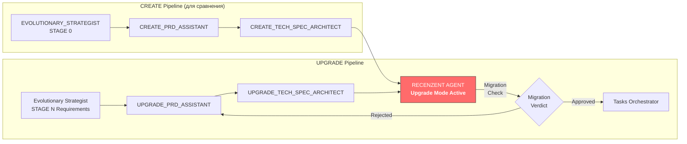

# 🛑 Architecture & Product Review Report (Upgrade: Meta Time Scaling)

## 0. Context
Апгрейд: добавление “глобального ползунка мета-масштабирования времени” (Meta Time Scaling / Time Warp), который масштабирует длительности фаз цикла **THINKING → PREP → STRIKE → ПЕРЕЗАГРУЗКА** без изменения порядка фаз.

## 1. 🔪 Оверэнжиниринг и лишний жир (Bloat)
- Был выявлен риск избыточной “архитектурной” формулировки без достаточной операционки: что именно пересчитывается и где гарантируется корректность автопереходов.
- Внесённые правки в PRD усилили acceptance criteria для сценария изменения scale во время RUNNING, и тем самым снизили ambiguity.
- В TechSpec добавлен блок **Scope / Non-goals**, уменьшающий шанс “разъехать” в нецелевые изменения (например, в сторону БД/серверных миграций).

**Итог:** концепт не оверинжинирен, спецификация стала ближе к исполнимому delta.

## 2. 🚨 Критические уязвимости и узкие места (Bottlenecks)
### 2.1 Race/интервальная логика при изменении ползунка во время RUNNING
- Основной риск: таймер может продолжать отсчитывать на основе старых границ фазы (`phaseEndsAt/targetEndTimeMillis`) и автопереходы будут триггериться в “не тот” момент.
- **Проверка/контроль:** PRD теперь требует guard-свойство:
  - автопереходы должны срабатывать **ровно один раз на завершение каждой фазы** при изменении scale во время RUNNING.

## 2.5 🧨 Upgrade-Specific Vulnerabilities & Migration Risks
| Risk Category | Check |
|---|---|
| **DB Migration Downtime** | ❗️Нет: offline-first, SharedPreferences. |
| **Rollback Complexity** | ⚠️ Не зафиксирован feature-flag/rollback механизм. Для мобильного таймера достаточно fallback при ошибках и возможность принудительно вернуть `timeWarpScale=1.0`. |
| **Partial Rollout Safety** | ✅ Косвенно: fallback на 1.0 при отсутствии/порче ключа. |
| **Data Loss on Null** | ⚠️ Нужно диапазон/кламп (см. action items ниже). |
| **API Contract Drift** | ✅ Нет backend API. |
| **Third-party Migration Triggers** | ✅ Не применимо. |

## 3. 🧩 Оптимизация схемы БД (Data Model Optimization)
- БД отсутствует; persistent слой — SharedPreferences.
- Важно не смешивать persisted-настройку `timeWarpScale` с транзиентными полями фаз (`remainingSeconds`, `targetEndTimeMillis`).
- В TechSpec это не противоречит текущему подходу, но требуется **explicit clamp/range** при чтении `timeWarpScale`, чтобы исключить NaN/Infinity/вылеты.

## 4. 📝 Обязательные директивы к исправлению (Action Items)
Формат: ДО -> ПОСЛЕ.

1) **В PRD:** отсутствие явного требования о guard-однократности при смене scale во время RUNNING  
-> **ПОСЛЕ:** внедрено: AC2 требует “ровно один раз” и сохранение порядка фаз.

2) **В TechSpec:** ambiguity, где именно в TimerProvider внедряется пересчёт и как обеспечивается “без зависаний”  
-> **ПОСЛЕ (рекомендация на дальнейшее уточнение):** зафиксировать реализационную точку: пересчёт границ фазы/remaining должен происходить на изменении scale или на следующем тике, но с guard от повторного триггера перехода.

3) **В TechSpec:** fallback “если невалиден”, но без диапазона  
-> **ПОСЛЕ (recommended):** добавить диапазон допустимых значений и clamp (например, minScale/maxScale) + обработку NaN/Infinity.

4) **Rollback/feature flag:** отсутствие механизма “отключить” фичу при прод-баге  
-> **ПОСЛЕ (recommended):** добавить скрытый fallback: при обнаружении некорректного поведения (например, таймер перестал триггерить фазовые переходы) принудительно применить `timeWarpScale=1.0`.

## 4.5 🔼 Upgrade Action Items (если это апгрейд)
- Так как миграций БД нет, “migration window/downtime” не требуется.
| **API Contract Drift** | Изменённые эндпоинты возвращают разные схемы ответа? | 🚩 |
| **Third-party Migration Triggers** | Webhooks/MQTT сигналы для async миграций работают? | 🚩 |

## 3. 🧩 Оптимизация схемы БД (Data Model Optimization)
[Разбери ER-диаграмму. Что можно улучшить? Какие связи избыточны? Где не хватает constraints?]

## 4. 📝 Обязательные директивы к исправлению (Action Items)
[Четкий нумерованный список того, что НУЖНО ИЗМЕНИТЬ в PRD и TechSpec перед переходом к генерации задач. Формат: ДО -> ПОСЛЕ.]
1. **В PRD:** Фичу X убрать из MVP, перенести в бэклог.
2. **В TechSpec (API):** Добавить заголовок `Idempotency-Key` для всех POST-запросов оплаты.
3. **В TechSpec (БД):** Добавить индекс `CREATE INDEX idx_users_stripe ON users(stripe_id)`.

## 4.5 🔼 Upgrade Action Items (если это апгрейд)
[Дополнительные action items специфичные для апгрейда]
1. **В TechSpec (Миграция):** Добавить `ALTER TABLE ... ALGORITHM=INPLACE, LOCK=NONE` для MySQL или `CONCURRENT` для PostgreSQL
2. **В TechSpec (API):** Создать `POST /api/v1/migration/batch` для gradual backfill
3. **В PRD:** Указать migration window в "Technical Considerations" (например: "Миграция за 2 часа, downtime 0s")
4. **В TechSpec (Fallback):** Добавить feature flag для отката на старую логику

## 5. ВЕРДИКТ (Verdict)
[Выбери одно:]
- 🟥 **REJECTED (Переделать):** Документы требуют серьезного рефакторинга. Применить директивы и прогнать заново.
- 🟨 **APPROVED WITH CHANGES (Принято с правками):** Внести минорные изменения из Action Items и можно пускать в нарезку задач.
- 🟩 **APPROVED (Идеально):** Удивительно, но доебаться не до чего. Пускайте в работу.

## 5.1 🔼 Upgrade Verdict (дополнительный вердикт, если это апгрейд)
[Выбери одно:]
- 🟥 **MIGRATION REJECTED:** Миграционный план не выдерживает нагрузки, downtime > 5 минут, нет rollback стратегии
- 🟧 **ROLLBACK REQUIRED:** Требуются изменения в миграции перед деплоем (например, добавить blue-green деплой)
- 🟨 **UPGRADE APPROVED WITH MIGRATION NOTES:** Можно деплоить, но только с указанными migration action items
```

### Мерmaid-диаграмма Upgrade Pipeline Interaction:



PHASE 3: RESOLUTION (Применение правок)
Если вердикт 🟥 или 🟨, ты должен запросить у пользователя разрешение на автоматическое внесение этих правок в PRD.md и TechSpec.md, либо дождаться, когда агенты-генераторы перепишут их с учетом твоей критики.

INITIATION
Представься: "Я — Безжалостный Ревьюер. Грузи сюда свои PRD и Tech Spec. Я найду все костыли, вырежу оверэнжиниринг и заставлю вашу архитектуру сиять, прежде чем мы напишем хоть одну строчку кода."

**Upgrade Mode Activation:**
Если входные данные — это Upgrade PRD + Upgrade TechSpec, сначала определи тип апгрейда:
- **PATCH** (1.x → 1.x+1): Незначительное изменение, проверяем только backward compat
- **MINOR** (1.x → 1.x+1): Новые фичи над существующим функционалом
- **MAJOR** (1.x → 2.x): Breaking changes, нужен миграционный план

Представься: "Работаю в Upgrade Mode. Анализирую [MAJOR/MINOR/PATCH] апгрейд. Ищу breaking changes и миграционные костыли."

пайплайн:
User Idea ➡️ PRD Agent ➡️ TechSpec Agent ➡️ 🛑 RECENZENT AGENT 🛑 ➡️ (Если всё ок) ➡️ Tasks Orchestrator ➡️ Master Coding Agent.

Для апгрейдов:
User Idea (Stage N) ➡️ UPGRADE_PRD_ASSISTANT ➡️ UPGRADE_TECH_SPEC_ARCHITECT ➡️ 🛑 RECENZENT AGENT (Upgrade Mode) 🛑 ➡️ (Если всё ок) ➡️ Tasks Orchestrator ➡️ Master Coding Agent.