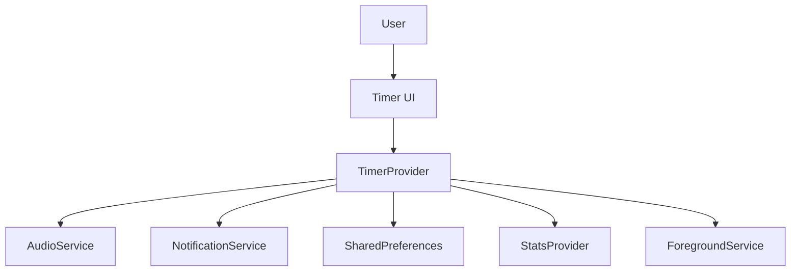
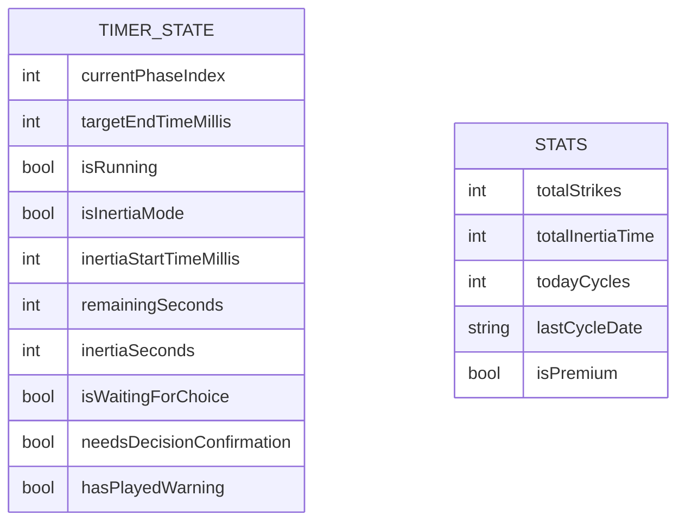
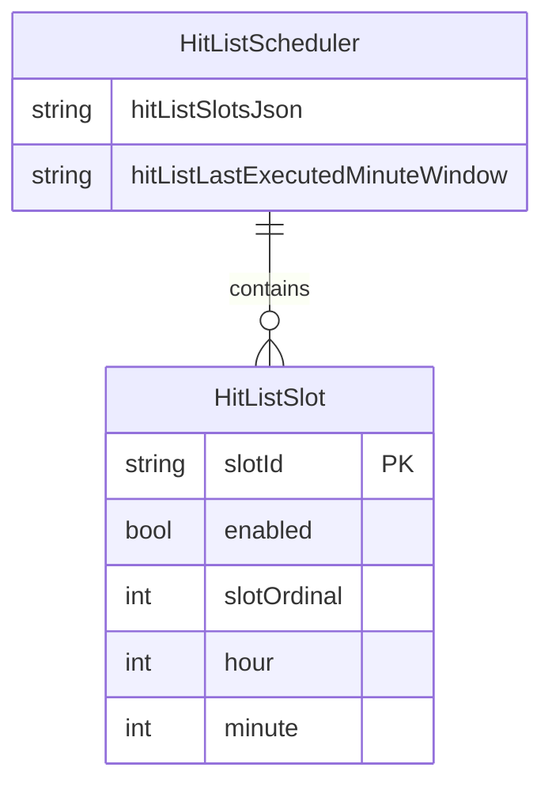

# Technical Design Document (TDD): 1234 Timer

## 1. System Architecture

### Overview
1234 Timer — это мобильное приложение (Flutter) с 4 фазами и множеством психологических микромеханик:
- **THINKING (60s)** → **PREP (120s)** → **STRIKE (180s)** → **ПЕРЕЗАГРУЗКА (60-240s случайно)**

Состояния: **Ready/Idle**, **Running**, **Paused**, **WaitingForChoice**, **DecisionConfirmation**



### Timing Model (без накопления ошибок)
- Используем `DateTime.now().millisecondsSinceEpoch` как источник времени
- Храним:
  - `phaseIndex`: 0-3 (THINKING, PREP, STRIKE, RECOVERY)
  - `status`: через поле `isRunning` (true/false) + `isWaitingForChoice` + `isInertiaMode` + `needsDecisionConfirmation`
  - `remainingMs` → `remainingSeconds`: integer секунды
  - `phaseEndsAt` → `targetEndTimeMillis`: absolute timestamp
  - `lastTickId` → `_timer`: Timer.periodic(200ms)
  - `inertiaStartTimeMillis`: для режима инерции
  - `inertiaSeconds`: счетчик в реальном времени

---

## 2. Database / Storage Schema

Stage 0 не требует сервера. Данные хранятся локально в SharedPreferences.



**Timer State (bypass_timer_state):**
```json
{
  "currentPhaseIndex": 0,
  "targetEndTimeMillis": null,
  "isRunning": false,
  "isInertiaMode": false,
  "inertiaStartTimeMillis": null,
  "remainingSeconds": 60,
  "inertiaSeconds": 0,
  "isWaitingForChoice": false,
  "needsDecisionConfirmation": false
}
```

**Stats (SharedPreferences keys):**
- `totalStrikes`: int
- `totalInertiaTime`: int (секунды)
- `todayCycles`: int
- `lastCycleDate`: string (YYYY-MM-DD)
- `isPremium`: bool

---

## 3. Frontend / Client Architecture

### Phase Configuration (фактические значения)

| Index | Название | Длительность | Цвет | Текст |
|-------|----------|--------------|------|-------|
| 0 | THINKING | 60s (1 мин) | #00D4FF (неоновый синий) | "РЕШЕНИЕ?" |
| 1 | PREP | 120s (2 мин) | #FF8A00 (оранжевый) | "ОРУЖИЕ К БОЮ!" |
| 2 | STRIKE | 180s (3 мин) | #FF0000 (красный) | "УНИЧТОЖАЙ" |
| 3 | ПЕРЕЗАГРУЗКА | 60-240s (случайно) | #0A1E5C (глубокий синий) | "БУДЬ ГОТОВ ВСЕГДА" |

### State Management (TimerProvider)

```dart
int _currentPhaseIndex = 0;         // Текущая фаза
int _remainingSeconds = 60;         // Оставшееся время
bool _isRunning = false;           // Таймер работает
bool _isInertiaMode = false;       // Режим инерции активен
int _inertiaSeconds = 0;          // Время в инерции
bool _isWaitingForChoice = false;  // Ожидание выбора (ИНЕРЦИЯ/ОТДЫХ)
bool _hasPlayedWarning = false;    // Флаг предупреждения
bool _needsDecisionConfirmation = false; // Требуется подтверждение решения
int? _targetEndTimeMillis;        // Абсолютное время окончания
int? _inertiaStartTimeMillis;     // Время старта инерции
Timer? _timer;                     // Основной таймер
Timer? _deadManSwitchTimer;       // Dead Man's Switch таймер
```

### Transitions Logic

**ENGAGE (toggle):**
- `isRunning == false` → `isRunning = true`, старт таймера
- `isRunning == true` → `isRunning = false`, пауза (сохранение remainingSeconds)
- Звук start.mp3 при любом нажатии

**HALT (reset):**
- `isRunning = false`
- `currentPhaseIndex = 0`
- `remainingSeconds = 60`
- Отмена всех таймеров
- Остановка foreground service
- Скрытие уведомлений

**Auto-transition при окончании фазы:**
- Фаза 0 (THINKING): остановка, `needsDecisionConfirmation = true`, зацикленный beep
- Фазы 0-1 (THINKING→PREP): автоматический переход
- Фазы 1-2 (PREP→STRIKE): автоматический переход
- Фаза 2 (STRIKE): остановка, `isWaitingForChoice = true`, Dead Man's Switch (30s)
- Фаза 3 (ПЕРЕЗАГРУЗКА): автоматический переход к фазе 0 и запуск нового цикла

### UI Components (MainScreen)

**Display:**
- "ФАЗА X. НАЗВАНИЕ" (верх)
- Текст фазы (центр)
- Таймер mm:ss (96pt monospace)
- **Прогресс-бар (4 сегмента)** - отличное от PRD отклонение
- Кнопка СТАРТ/ПАУЗА (цвет фазы)
- Кнопка СБРОС (при паузе)

**Overlays:**
- Decision Confirmation Overlay: "РЕШЕНИЕ ПРИНЯТО?" (после THINKING)
- Инерция Mode: замена таймера на секунды инерции

---

## 4. Audio System (Stage 8)

### AudioService (just_audio)
```dart
// Sounds
'start.mp3'     // Нажатие СТАРТ/ПАУЗА
'bolt.mp3'      // Переход к фазе PREP (1→2)
'siren.mp3'       // Переход к фазе STRIKE (2→3)
'rest.mp3'       // Начало ПЕРЕЗАГРУЗКИ
'ignite.mp3'     // Активация инерции
'beep.mp3'       // Предупреждение + Dead Man's Switch
'scan.mp3'       // Конец цикла (переход к THINKING)
```

### Sound Triggers
- `toggle()`: start.mp3 всегда
- `playPhaseSound(phaseIndex)`: звук перехода между фазами
- `playWarningSound()`: 6 секунд до конца (кроме STRIKE)
- `startLoopingBeep()`: при Target Confirmation и Waiting For Choice (20 минут)
- `playInertiaSound()`: при активации инерции
- `playCycleEndSound()`: при окончании цикла

---

## 5. Notification System

### NotificationService (flutter_local_notifications)
- Канал: `bypass_1236_audio_channel`
- ID: 1236
- Показ текущей фазы и оставшегося времени
- Обновление каждую секунду
- Скрытие при паузе/reset

---

## 6. Stats & Ranks (Stage 9-10)

### Rank System (геометрическая прогрессия)
```
ROOKIE (100) → RECRUIT (200) → SOLDIER (350) → EXECUTOR (550) → STRIKER (850) → 
DESTROYER (1300) → PHANTOM (2000) → TITAN (3000) → ARCHON (4500) → LEGEND (6700) → 
SLAYER (10000) → WARLORD (15000) → OVERLORD (22500) → APEX PREDATOR (33750) → ULTIMATUM (50000)
```

### Stats Metrics
- `totalStrikes`: завершенные циклы
- `totalInertiaTime`: суммарное время инерции (сек)
- `totalDominationHours`: (strikes * 180 + inertiaTime) / 3600

---

## 7. Paywall & Limits (Stage 11)

### Free Tier Limitations
- `freeCyclesPerDay = 3`
- Инерция недоступна
- Ограничение проверяется в `canStartCycle`

### Premium Features
- Бесконечные циклы
- Режим ИНЕРЦИЯ
- Полная статистика
- Статус: `isPremium = true`

---

## 8. Acceptance Criteria (Фактическое поведение)

### AC1: Загрузка
- ✅ UI отображает "ФАЗА 1. THINKING" и "01:00"
- ✅ Состояние восстанавливается из SharedPreferences

### AC2: Пауза/Resume
- ✅ ENGAGE во время RUNNING → PAUSE
- ✅ ENGAGE при PAUSE → RESUME с тем же remaining

### AC3: HALT
- ✅ HALT → сброс к ФАЗА 1 и 01:00
- ✅ Автопереходы отменяются

### AC4: Автопереходы
- ✅ 0 (THINKING) завершается → Target Confirmation
- ✅ 1 (PREP) → 2 (STRIKE) автоматически
- ✅ 2 (STRIKE) → Waiting For Choice (ИНЕРЦИЯ/ОТДЫХ)
- ✅ 3 (ПЕРЕЗАГРУЗКА) → 0 (THINKING) автоматически

### AC5: Поведение после фазы 3
- ✅ Автоматический переход к THINKING + запуск
- ❌ Отличие от PRD: не останавливается на 00:00

### AC6: UI
- ✅ Отображается "ФАЗА X. НАЗВАНИЕ"
- ✅ Формат времени mm:ss
- ✅ **Отклонение:** прогресс-бар добавлен (4 сегмента)

### AC7: Тайминг
- ✅ DateTime.now() + targetEndTimeMillis
- ✅ Без накопления ошибок

---

## 🛑 As-Built Deviations (Отклонения реальности от плана)

### Stage 0: Core Mechanic
1. **Фазы:** Было "1-2-3-6", стало "1-2-3" с 4 фазами (THINKING, PREP, STRIKE, ПЕРЕЗАГРУЗКА)
2. **UI:** Добавлен прогресс-бар (4 сегмента), запрещенный в Stage 0
3. **Хранилище:** SharedPreferences вместо in-memory state
4. **Platform:** Flutter/Dart вместо browser JS (performance.now)
5. **Time source:** DateTime.now().millisecondsSinceEpoch вместо performance.now()

### Stage 5-7: Психологические механики (ранний внедр)
1. **Инерция:** Реализована в Stage 0 (должна быть Stage 5)
2. **Target Confirmation:** Реализован в Stage 0 (должен быть Stage 6)
3. **Chaos Protocol:** Случайная длительность и скрытый таймер (должен быть Stage 7)

### Stage 8: Audio
1. **AudioService:** Использует just_audio вместо Web Audio API
2. **Звуки:** Все 8 звуковых файлов реализованы

### Stage 9-10: Stats & Ranks
1. **StatsProvider:** Полная статистика реализована
2. **StatsScreen:** Экран "БОЕВЫЕ ЗАСЛУГИ" с рангами

### Stage 11: Paywall
1. **PaywallScreen:** UI реализован
2. **Лимиты:** 3 цикла/день для free
3. **Оплата:** Mock-реализация (activatePremium())

### Технические компромиссы
1. **Background execution:** Foreground service (Android only) для работы в фоне
2. **Audio initialization:** Graceful degradation при ошибках
3. **Notification:** flutter_local_notifications с кастомным каналом
4. **Wakelock:** wakelock_plus для предотвращения сна экрана

---

### As-Built Deviations — V1.1 / V1.2 (Meta Time Scaling & Deep Flow Inertia)

1. **Dead Man's Switch после STRIKE удалён.** В изначальном Stage 0/PRD после STRIKE запускался 30-секундный Dead Man's Switch → авто-отдых. В V1.2 эта ветка полностью убрана: метод `_startDeadManSwitch` удалён из `TimerProvider`, выбор ИНЕРЦИЯ/ОТДЫХ больше не запрашивается. Вместо него — авто-вход в INERTIA.
2. **INERTIA auto-enter больше не требует Premium.** В Stage 11 (Paywall) ИНЕРЦИЯ была доступна только Premium-пользователям (`activateInertia` проверял `isPremium`). В V1.2 авто-вход в INERTIA (`_enterInertiaMode`) выполняется для ВСЕХ пользователей сразу после STRIKE, без проверки Premium. Старый `activateInertia` остался в коде, но стал недостижим из UI (dead code).
3. **`currentPhaseTransitionId` реализован иначе.** Вместо единого монотонного id, сохранённого в state (как описано в контракте), используется пара полей: `_lastInertiaPhaseTransitionId` (persisted) + `_currentStrikeTransitionId` (runtime, сбрасывается при входе в STRIKE). Guard от повторного входа достигается комбинацией этих полей и проверки `_isInertiaMode`.
4. **Дополнительный persisted key `currentPhaseBaseSeconds`.** Добавлен в V1.1 (TASK-V1.1-003) для пересчёта окончания фазы при смене `timeWarpScale` во время RUNNING; отсутствует в изначальном контракте V1.2, но персистится в `bypass_timer_state`.
5. **Pulse INERTIA масштабируется `timeWarpScale`.** Базовый рандом 2–3 мин умножается на `timeWarpScale` (cross-upgrade взаимодействие V1.1×V1.2). При смене ползунка во время INERTIA отложенный pulse пересчитывается пропорционально.
6. **MAX FLOW: добавлены звук и кнопка NO.** При достижении 3 циклов играет `beep.mp3` ровно один раз; оверлей содержит кнопки **YES** (продолжить) и **NO** (немедленный выход в ОТДЫХ), плюс авто-выход по таймауту 30с. В уведомлении INERTIA показывается счётчик «Цикл X/3».
 7. **`timeWarpScale` — единственная точка применения масштаба.** Все фазы и pulse масштабируются только через `timeWarpScale`; порядок фаз и точки переходов неизменны.

---

### As-Built Deviations — V1.3 (Auto-Start Scheduler «THE HIT-LIST»)

1. **Добавлен выделенный звуковой сигнал срабатывания расписания (`playScheduleAlarm`).**
   В изначальном blueprint roadmap Stage 7 (§2) прямо сказано: «НИКАКИХ дополнительных сигналов/уведомлений пользователю не требуется … никаких beep/месседжей». По факту (progress.md, 2026-07-15, пользовательский фидбек) при HIT-LIST авто-старте воспроизводится **отдельный непрерывный `beep.mp3` длительностью ≥ 30 секунд** через `AudioService.playScheduleAlarm()` / `stopScheduleAlarm()`. Это явное отклонение от «тихого» старта из blueprint; в V1.3-спеке поведение скорректировано на «best-effort звук как при обычном старте» + данный sustained-сигнал. Сигнал останавливается на `reset()` и на подтверждении решения (ДА/НЕТ) и не дублируется с зацикленным beep оверлея Decision Confirmation.
2. **Триггер — внутриприложный poll, а не системный будильник.**
   Roadmap Stage 7 (§2, AC5) требовал «права уровня как у будильника … чтобы авто-старт происходил даже если приложение выключено/в фоне». Реализовано через `Timer.periodic(15s)` внутри `HitListProvider` поверх времени жизни foreground service. Нет Android `AlarmManager` (exact alarm), нет `BOOT_COMPLETED`-receiver, нет auto-start после перезагрузки. AC5 roadmap фактически **не выполнен**: авто-старт работает только пока процесс жив. Idempotent-ключ `hitListLastExecutedMinuteWindow` гарантирует отсутствие дублей при повторных poll/рестартах, но не компенсирует пропуск срабатывания, если приложение было выгружено в момент HH:mm.
3. **Режим «Repeat daily = однократно» НЕ реализован.**
   Roadmap Stage 7 (§4) описывал флажок «Repeat daily»: включён → повторять каждый день, выключен → однократный запуск. В V1.3-спеке (и в коде) выбран упрощённый вариант: **все включённые слоты повторяются ежедневно**, переключателя однократности нет (в `HitListSlot` присутствует только `enabled`, без `repeatDaily`). Однократный авто-старт исключён из объёма V1.3.
4. **Winner при конфликте одинакового HH:mm — детерминирован по `slotOrdinal`.**
   Совпадает со спецификацией V1.3 (§3.2): при нескольких `enabled`-слотах на одно время запускается ровно один — с минимальным `slotOrdinal`. Реализовано в `processScheduledTriggers()` (sort + `first`).
5. **Идемпотентность «один раз на окно» реализована через общий ключ `yyyy-MM-dd|HH:mm`.**
   Поле `hitListLastExecutedMinuteWindow` (persisted) + `AppConstants.hitListWindowKey()`. Совпадает со спецификацией V1.3 §2/§3 (окно без `slotId`). Дубликаты в одну минуту исключены даже при нескольких слотах/повторных poll.

---

## 9. Security & Authentication

Stage 0-4: **без Auth**, **без пользователей**. Все локально.

---

## 10. Error Handling

- Все сервисы работают в `try-catch`
- Graceful degradation при ошибках audio/notification
- Safe state на READY/Фаза 1 при ошибках

---
*Добавлено: 2026-06-14*
## Architecture Upgrade: Version 1.1 - Meta Time Scaling (Global Time Warp)

### 0. Scope / Non-goals
- Не меняем порядок фаз и точки переходов (THINKING → PREP → STRIKE → ПЕРЕЗАГРУЗКА).
- Не добавляем сервер/БД: только локальная настройка в state/UI.

### 1. Architectural Changes (Изменения в архитектуре)
Добавляется глобальный параметр **timeWarpScale** (ползунок Meta Time Scaling), который применяется в логике расчёта тайминга фаз внутри `TimerProvider`.

Новый принцип:
- **Порядок фаз и точки переходов не меняются**: THINKING → PREP → STRIKE → ПЕРЕЗАГРУЗКА.
- **Масштаб меняет только темп**: длительность фаз (и оставшееся время) вычисляется с учётом `timeWarpScale`.
- **Требование “без зависания”**: при любом изменении `timeWarpScale` автопереходы продолжают срабатывать по корректно масштабированному таймингу; таймер не должен “переставать” завершать фазу.

### 2. Database Migrations (Миграции БД)
Server-side БД нет, только offline state в SharedPreferences.

**Storage (SharedPreferences / timer state) — (ALTER, CREATE keys):**
- Добавить ключ **`timeWarpScale`** (double, Nullable) в локально-персистентное состояние настроек/таймера.
- Backward compatibility:
  - если ключ отсутствует — default `timeWarpScale = 1.0`.

### 3. API Delta Contracts (Изменения в контрактах API)
Backend/API отсутствует.
- **Внутренний контракт:** `TimerProvider` получает текущее значение `timeWarpScale` из UI Settings/State и применяет его при вычислениях:
  - вычисление `targetEndTimeMillis`/`remainingSeconds`
  - проверка условий завершения фазы для автопереходов

### 4. Infrastructure & Third-Party (Инфраструктура)
Не требуется новых интеграций/сервисов.

### 5. Fallback & Migration Strategy (План Б)
- Если `timeWarpScale` недоступен/невалиден — fallback `timeWarpScale = 1.0`.
- Если пользователь меняет ползунок во время RUNNING:
  - поведение должно обеспечивать продолжение автопереходов (переходы не должны “останавливаться” из-за рассинхрона тайминга).

---
*Добавлено: 2026-07-13*
## Architecture Upgrade: Version 1.2 - Deep Flow Inertia Controller (Auto after Phase 3)

### 1. Architectural Changes (Изменения в архитектуре)
Цель апгрейда — убрать ветвление после завершения фазы 3 (“Уничтожай”) и переводить пользователя в режим **INERTIA** автоматически, без UI выбора “⚡ ИНЕРЦИЯ / 🧠 ОТДЫХ”.

Изменения в state machine (delta):
- **Было:** после завершения **STRIKE (фаза 3)** система переводит в ветку ожидания выбора режимов (ИНЕРЦИЯ/ОТДЫХ) с Dead Man's Switch (30с → авто-отдых).
- **Стало:** после завершения **STRIKE (фаза 3)** сразу и автоматически:
   - включается `isInertiaMode = true` (без проверки Premium — см. As-Built Deviations V1.2)
   - вход в INERTIA выполняется **один раз** на одно завершение STRIKE (guard: `_lastInertiaPhaseTransitionId` + `_currentStrikeTransitionId`, плюс проверка `_isInertiaMode`)
- **Удалено:** Dead Man's Switch после STRIKE полностью убран (метод `_startDeadManSwitch` удалён из `TimerProvider`); выбор ИНЕРЦИЯ/ОТДЫХ больше не запрашивается.
- В INERTIA применяется отдельная внутренняя логика:
  - планировщик мягких pulse-сигналов каждые **2–3 минуты** (рандом внутри диапазона) только пока активен `isInertiaMode`.
  - лимитер бездействия “MAX FLOW” на **3 цикла** (нарастание счётчика при отсутствии ответа/действий пользователя).
  - 30-секундное окно confirm на 3-м цикле:
    - если пользователь не подтверждает **YES в течение 30 секунд**, система автоматически переводит в стандартный **ОТДЫХ** (recovery/rest flow).

### 2. Database Migrations (Миграции БД)
Серверной БД нет; сохраняется только локальное состояние в **SharedPreferences** (offline persistence). Для сохранения устойчивости после перезапуска приложения добавляем *дополнительные поля* в `bypass_timer_state`.

**Storage (SharedPreferences / timer state) — (ALTER, new optional keys):**
- **Добавить (nullable / safe defaults):**
  - `inertiaCycleCount` (int, default `0`)
    - Количество завершенных “инерционных циклов” внутри INERTIA.
    - Цикл инкрементится ровно один раз на каждое *одно* срабатывание pulse внутри INERTIA, если до этого не было `EXIT` и overlay MAX FLOW не был закрыт через `YES`.
  - `inertiaNextPulseAtMillis` (int?, default `null`)
    - абсолютное время следующего pulse (deadline).
  - `inertiaPulseFiredAtMillis` (int?, default `null`)
    - абсолютное время последнего *успешного* “fire” pulse.
    - Guard one-time: pulse считается “выполненным” если `inertiaPulseFiredAtMillis != null && inertiaPulseFiredAtMillis == inertiaNextPulseAtMillis`.
  - `inertiaPendingMaxFlowConfirmUntilMillis` (int?, default `null`)
    - абсолютное время истечения 30-секундного окна на 3-м цикле
  - `isInertiaConfirmShown` (bool, default `false`)
    - флаг отображения overlay “MAX FLOW REACHED. CONTINUE?”
  - `lastInertiaForPhase3EndMillis` (int?, default `null`)
    - guard входа в INERTIA ровно один раз на *конкретное* завершение STRIKE.
    - Правило: вход выполняется только если `lastInertiaForPhase3EndMillis != phase3EndTimeMillis` (где `phase3EndTimeMillis` = `targetEndTimeMillis` в момент завершения STRIKE).
  - `currentPhaseBaseSeconds` (int, default `phase1Duration`=60)
    - Оставляется как вспомогательное поле из V1.1 для пересчётов в RUNNING.

**Удалить из контракта:**
- `lastInertiaPhaseTransitionId`
- `currentPhaseTransitionId` (composite/monotonic ids)

**Backward compatibility:**
- Если ключи отсутствуют (старые версии приложения):
  - `inertiaCycleCount = 0`
  - `inertiaNextPulseAtMillis = null` (планировщик создаётся при старте INERTIA)
  - `isInertiaConfirmShown = false`
  - `inertiaPendingMaxFlowConfirmUntilMillis = null`
  - `lastInertiaPhaseTransitionId = null` (guard устанавливается при первом завершении STRIKE в сессию)

**Схема новых связей (Delta ERD):**
```mermaid
erDiagram
    TIMER_STATE {
        int inertiaCycleCount
        int? inertiaNextPulseAtMillis
        bool isInertiaConfirmShown
        int? inertiaPendingMaxFlowConfirmUntilMillis
        int currentPhaseBaseSeconds
    }
```

### 3. API Delta Contracts (Изменения в контрактах API)
Backend/API отсутствует. Изменение — в *контракте поведения* UI и `TimerProvider`.

**NEW/Modified UI behavior (delta contracts):**
   - **INERTIA entry trigger (MODIFIED):**
     - Триггер: завершение **STRIKE**.
     - Действие: `TimerProvider` выставляет `isInertiaMode = true` без пользовательского перехода/выбора (и **без проверки Premium** — см. As-Built Deviations V1.2).
     - Звук: проигрывается `bypass-app\bypass-apk\assets\sounds\ignite.mp3` при входе в INERTIA (best-effort, переход не зависит от ошибок audio).
- **INERTIA UI lock (MODIFIED):**
  - В INERTIA показывается только одна кнопка: `EXIT`
  - Отсутствуют действия/кнопки кроме `EXIT` (и временного overlay confirm на 3-м цикле).
- **MAX FLOW confirm (NEW):**
   - Счётчик циклов INERTIA отображается в уведомлении: «Цикл X/3» (виден весь режим INERTIA).
   - При достижении лимита (3 циклов без действий) появляется оверлей (всё ещё в режиме INERTIA):
     - “MAX FLOW REACHED. CONTINUE?”
     - звук `beep.mp3` проигрывается **ровно один раз** в момент появления оверлея (`playDeadManSwitchSound`).
   - Ожидание ответа в течение **30 секунд**:
     - **YES** (`confirmMaxFlow()`) → оверлей закрывается, INERTIA продолжается, счётчик циклов сбрасывается.
     - **NO** (`declineMaxFlow()`) → немедленный выход в **ОТДЫХ**.
     - нет ответа за 30с (`_autoExitMaxFlow()`) → автоматический переход в **ОТДЫХ**.
   - **Взаимодействие с V1.1:** интервал pulse INERTIA (базовый рандом 2–3 мин) ДОПОЛНИТЕЛЬНО масштабируется глобальным `timeWarpScale` (см. `_scheduleNextPulse`). При смене ползунка во время RUNNING отложенный pulse пересчитывается пропорционально (см. `setTimeWarpScale`).

**Breaking change?**
- Нет. Это изменение *ветвления в UI/flow после фазы 3*.
- Порядок фаз не нарушается: после INERTIA система продолжает стандартный recovery/rest сценарий так, как было предусмотрено ранее.

### 4. Infrastructure & Third-Party (Инфраструктура)
- Новые интеграции не требуются.
- Используется существующий аудио-ресурс:
  - `ignite.mp3` для входа и мягких pulse-сигналов в INERTIA.
- Тайминг pulse реализуется через существующую модель абсолютных timestamp’ов (`...AtMillis`) для устойчивости к пересчётам/паузам/перезапускам.

### 5. Fallback & Migration Strategy (План Б)
- Если после рестарта не удалось восстановить `inertiaNextPulseAtMillis` (ключ `null`):
  - при первом входе в INERTIA планировщик пересчитывает `inertiaNextPulseAtMillis` заново.
- Anti-double pulse после рестарта:
  - если `inertiaNextPulseAtMillis != null` и `inertiaPulseFiredAtMillis == inertiaNextPulseAtMillis` — pulse **не** должен повторно “fire” до следующего пересчёта deadline.
- Если confirm overlay не был восстановлен корректно (`isInertiaConfirmShown=false` при наличии pending timestamp):
  - при обнаружении `inertiaPendingMaxFlowConfirmUntilMillis != null` overlay должен быть показан до истечения 30 секунд (или сразу отработан авто-выход при истечении).
- Guard от повторного входа в INERTIA:
  - `lastInertiaForPhase3EndMillis` используется как “одиночное срабатывание” на конкретное завершение STRIKE (по `phase3EndTimeMillis`).
- Если воспроизведение `ignite.mp3` недоступно/провалилось:
  - аудио — best-effort, но переходы в INERTIA/ОТДЫХ должны происходить независимо от успешности audio.

---
*Добавлено: 2026-07-14*
## Architecture Upgrade: Version 1.3 - Auto-Start Scheduler (“THE HIT-LIST”)

### 1. Architectural Changes (Изменения в архитектуре)
Добавляется новый пользовательский сценарий и компонент планировщика, который автоматически инициирует цикл продуктивности в заданное пользователем время.

**Новый компонент: HitListScheduler (на клиенте)**
- Ответственность:
  - хранить список слотов расписания (до 10);
  - при включенном хотя бы одном слоте — инициировать daily trigger в выбранное HH:mm;
  - обеспечивать анти-дубликаты и идемпотентность “один раз на окно”;
  - предотвращать конфликт с активным циклом: **если `TimerProvider.isRunning == true`, авто-старт не выполняется**.
- Реализация по архитектурным принципам текущего проекта:
  - без server/remote DB;
  - все состояние и идемпотентные ключи — через SharedPreferences (см. Storage / Database Migrations).

**Новый экран: HitListScreen**
- Управляет слотами (add/remove, enable/disable, выбор HH:mm через ползунки).
- Экран должен быть доступен пользователю через существующий UI (например SettingsScreen).

**Точка интеграции с TimerProvider**
- Планировщик вызывает “мягкое действие” в `TimerProvider`:
  - переводит систему в сценарий **фаза 0 → ожидание подтверждения решения** (“РЕШЕНИЕ?”), как при обычном ручном нажатии/старте.
- При любом автозапуске соблюдается guard:
  - если `isRunning == true` — планировщик делает no-op (ничего не меняет).

### 2. Database Migrations (Миграции БД)
Server-side БД отсутствует; изменения касаются только локального persistence в SharedPreferences и/или persisted state внутри `bypass_timer_state`.

#### Storage (SharedPreferences / timer state) — (ALTER, new optional keys)
Добавляются **новые nullable/опциональные** ключи. Если ключ отсутствует (старые версии приложения), используются безопасные defaults.

1) **HitList slots**
- `hitListSlotsJson` (String?, default: `null`)
  - сериализованный JSON массив слотов:
    - `slotId` (String, уникальный в пределах приложения)
    - `enabled` (bool)
    - `slotOrdinal` (int, стабильный порядок/вес для детерминизма)
    - `hour` (int 0..23)
    - `minute` (int 0..59)
- Backward compatibility:
  - если `null` → трактовать как пустой список (нет активных слотов).

2) **Идемпотентность “один раз на окно” (упрощенная модель)**
- `hitListLastExecutedMinuteWindow` (String?, default: `null`)
  - формат `dayWindowKey = yyyy-MM-dd|HH:mm` (без slotId)
  - если `dayWindowKey == текущая_дата|HH:mm` — автозапуск для любых слотов этой минуты является no-op.
- Backward compatibility:
  - если `null` → окно еще не выполнялось, первая сработка пройдет.

**Схема новых связей (Delta ERD)**


### 3. API Delta Contracts (Изменения в контрактах API)
Backend/API отсутствует. Изменение — в контрактах поведения между UI/сcheduler и `TimerProvider`.

#### 3.1. TimerProvider: новые поведенческие контракты (delta)
Добавляются методы (или внутренние публичные контракт-коллбеки) для автозапуска.

**Guard (обязательный AC1.3.4 + AC1.3.5)**
- При триггере планировщика:
  - если `timerProvider.isRunning == true` → **не инициировать** авто-старт.

**Auto-start входной контракт (AC1.3.2)**
- `autoStartFromScheduler(triggerKey, slotId, scheduledAtLocalMillis)`:
  - цель: инициировать цикл в состоянии:
    - `currentPhaseIndex = 0`
    - `needsDecisionConfirmation = true` (overlay “РЕШЕНИЕ ПРИНЯТО?” ожидает YES/NO как в стандартной логике старта THINKING → Decision Confirmation)
  - должен быть idempotent (AC1.3.5):
    - если `triggerKey` уже был выполнен в этот день/в это HH:mm для `slotId` → no-op.
  - должен обеспечивать “один раз на окно” (AC1.3.3):
    - если windowKey `yyyy-MM-dd|HH:mm` уже был исполнен — no-op для остальных slot’ов на той же минуте.

**Side effects (best-effort)**
- Включить ту же best-effort инициализацию звука/уведомлений, что и для обычного старта.
- Дополнительно воспроизводится **выделенный сигнал срабатывания расписания** (см. As-Built Deviations V1.3, п.1): `AudioService.playScheduleAlarm()` — зацикленный `beep.mp3`, гарантированно ≥ 30 секунд. Это отличает HIT-LIST-автостарт от обычного ручного старта (который играет только короткий `start.mp3`).
- Ошибки аудио/уведомлений не ломают state machine: переход в фазу 0 должен происходить независимо от успеха воспроизведения.
- Сигнал `playScheduleAlarm()` корректно останавливается при `reset()` и при подтверждении решения (ДА/НЕТ) — без дублей с зацикленным beep оверлея Decision Confirmation.

#### 3.2. HitListScheduler: контракт триггера
- Daily trigger генерирует “event” в момент HH:mm.
- Event processing включает:
  1) guard `!timerProvider.isRunning`
  2) anti-duplicate per minute windowKey
  3) idempotency per triggerKey
  4) вызов `timerProvider.autoStartFromScheduler(...)` ровно один раз на окно

> Примечание по “выбору победителя” при конфликте одинакового HH:mm:
> - Детерминизм только через `slotOrdinal` (int, стабильный порядок).
> - Winner = слот с минимальным `slotOrdinal` среди `enabled` слотов на это HH:mm.
> - Это исключает “плавающее” поведение при перестановках массива/редактировании.

### 4. Infrastructure & Third-Party (Инфраструктура)
#### Использование существующей инфраструктуры
- Логика планирования может использовать уже существующие механизмы фонового присутствия:
  - текущая Android foreground service (из ас-built/существующих модулей)
  - flutter_local_notifications (для UI/событий)
- Никаких новых внешних сервисов/провайдеров.

#### Scheduled triggers (ежедневно)
- Требование AC1.3.2: авто-старт ежедневно в выбранное HH:mm.
- Архитектурное требование:
  - scheduler должен уметь восстановить активные слоты после перезапуска приложения;
  - расписание должно продолжать триггеры, пока включен хотя бы один слот (AC1.3.1/AC1.3.2).

> 🛑 **Реальный механизм триггера (as-built):** ежедневная доставка реализована **не** через системный Android `AlarmManager` / exact-alarm / `BOOT_COMPLETED`-receiver, а через **внутриприложный периодический poll** (`HitListProvider._startPolling`, интервал `hitListPollIntervalSeconds = 15`). Poll живёт пока запущен foreground service / процесс приложения. Следствия (см. As-Built Deviations V1.3, п.2):
> - авто-старт срабатывает **только пока приложение живо в памяти/в фоне**;
> - при полном выгрузке процесса или перезагрузке устройства расписание **не сработает, пока пользователь не откроет приложение** (idempotent windowKey не даёт дублей, но и не компенсирует пропуск);
> - права «как у будильника» (AC5 roadmap Stage 7) фактически **не запрошены и не реализованы**.

### 5. Fallback & Migration Strategy (План Б)
1) **Нет ключей расписания (старые версии приложения)**
- `hitListSlotsJson == null` → считать, что слотов нет → планировщик не инициирует автозапуск.

2) **Нет идемпотентных ключей**
- `hitListLastExecutedMinuteWindow == null`:
  - windowKey считается не выполненным, первая сработка выполнит запуск (winner), повтор в эту минуту no-op.

3) **Конфликты в одном окне (несколько слотов на одно время)**
- Даже если триггер событие пришло несколько раз (например, из-за повторного scheduling/перестроения):
  - `hitListLastExecutedMinuteWindow` обеспечит “только один запуск” на минуту.
  - В winner-rule детерминизм обеспечивается `slotOrdinal`, поэтому выбранный слот стабилен.

4) **После рестарта**
- При восстановлении state:
  - scheduler перезагружает `enabled` слоты;
  - идемпотентность сохраняется через persisted keys.
- Если “невозможно восстановить последний scheduled event”, планировщик все равно должен:
  - корректно обработать следующую ежедневную минуту (AC1.3.2/AC1.3.5).

5) **Guard “не стартовать при активной работе”**
- Всегда проверять `timerProvider.isRunning` перед любым autoStart.
- Это требование защищает от перезапуска текущего цикла и конфликтов с фазовой машиной.


