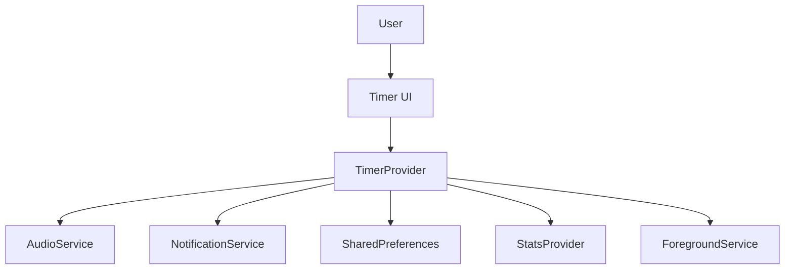
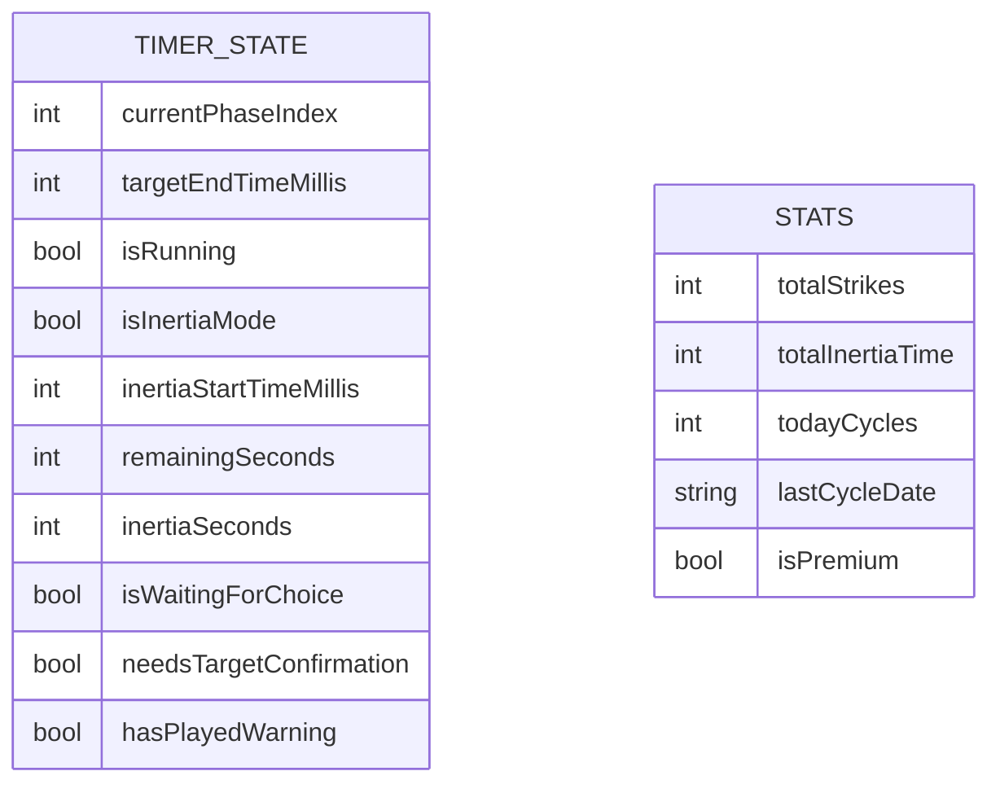

# Technical Design Document (TDD): 1234 Timer

## 1. System Architecture

### Overview
1234 Timer — это мобильное приложение (Flutter) с 4 фазами и множеством психологических микромеханик:
- **THINKING (60s)** → **PREP (120s)** → **STRIKE (180s)** → **ПЕРЕЗАГРУЗКА (60-240s случайно)**

Состояния: **Ready/Idle**, **Running**, **Paused**, **WaitingForChoice**, **TargetConfirmation**



### Timing Model (без накопления ошибок)
- Используем `DateTime.now().millisecondsSinceEpoch` как источник времени
- Храним:
  - `phaseIndex`: 0-3 (THINKING, PREP, STRIKE, RECOVERY)
  - `status`: через поле `isRunning` (true/false) + `isWaitingForChoice` + `isInertiaMode` + `needsTargetConfirmation`
  - `remainingMs` → `remainingSeconds`: integer секунды
  - `phaseEndsAt` → `targetEndTimeMillis`: absolute timestamp
  - `lastTickId` → `_timer`: Timer.periodic(200ms)
  - `inertiaStartTimeMillis`: для режима инерции
  - `inertiaSeconds`: счетчик в реальном времени

---

## 2. Database / Storage Schema

Stage 0 не требует сервера. Данные хранятся локально в SharedPreferences.



**Timer State (bypass_timer_state):**
```json
{
  "currentPhaseIndex": 0,
  "targetEndTimeMillis": null,
  "isRunning": false,
  "isInertiaMode": false,
  "inertiaStartTimeMillis": null,
  "remainingSeconds": 60,
  "inertiaSeconds": 0,
  "isWaitingForChoice": false,
  "needsTargetConfirmation": false
}
```

**Stats (SharedPreferences keys):**
- `totalStrikes`: int
- `totalInertiaTime`: int (секунды)
- `todayCycles`: int
- `lastCycleDate`: string (YYYY-MM-DD)
- `isPremium`: bool

---

## 3. Frontend / Client Architecture

### Phase Configuration (фактические значения)

| Index | Название | Длительность | Цвет | Текст |
|-------|----------|--------------|------|-------|
| 0 | THINKING | 60s (1 мин) | #00D4FF (неоновый синий) | "ЦЕЛЬ?" |
| 1 | PREP | 120s (2 мин) | #FF8A00 (оранжевый) | "ОРУЖИЕ К БОЮ!" |
| 2 | STRIKE | 180s (3 мин) | #FF0000 (красный) | "УНИЧТОЖАЙ" |
| 3 | ПЕРЕЗАГРУЗКА | 60-240s (случайно) | #0A1E5C (глубокий синий) | "БУДЬ ГОТОВ ВСЕГДА" |

### State Management (TimerProvider)

```dart
int _currentPhaseIndex = 0;         // Текущая фаза
int _remainingSeconds = 60;         // Оставшееся время
bool _isRunning = false;           // Таймер работает
bool _isInertiaMode = false;       // Режим инерции активен
int _inertiaSeconds = 0;          // Время в инерции
bool _isWaitingForChoice = false;  // Ожидание выбора (ИНЕРЦИЯ/ОТДЫХ)
bool _hasPlayedWarning = false;    // Флаг предупреждения
bool _needsTargetConfirmation = false; // Требуется подтверждение цели
int? _targetEndTimeMillis;        // Абсолютное время окончания
int? _inertiaStartTimeMillis;     // Время старта инерции
Timer? _timer;                     // Основной таймер
Timer? _deadManSwitchTimer;       // Dead Man's Switch таймер
```

### Transitions Logic

**ENGAGE (toggle):**
- `isRunning == false` → `isRunning = true`, старт таймера
- `isRunning == true` → `isRunning = false`, пауза (сохранение remainingSeconds)
- Звук start.mp3 при любом нажатии

**HALT (reset):**
- `isRunning = false`
- `currentPhaseIndex = 0`
- `remainingSeconds = 60`
- Отмена всех таймеров
- Остановка foreground service
- Скрытие уведомлений

**Auto-transition при окончании фазы:**
- Фаза 0 (THINKING): остановка, `needsTargetConfirmation = true`, зацикленный beep
- Фазы 0-1 (THINKING→PREP): автоматический переход
- Фазы 1-2 (PREP→STRIKE): автоматический переход
- Фаза 2 (STRIKE): остановка, `isWaitingForChoice = true`, Dead Man's Switch (30s)
- Фаза 3 (ПЕРЕЗАГРУЗКА): автоматический переход к фазе 0 и запуск нового цикла

### UI Components (MainScreen)

**Display:**
- "ФАЗА X. НАЗВАНИЕ" (верх)
- Текст фазы (центр)
- Таймер mm:ss (96pt monospace)
- **Прогресс-бар (4 сегмента)** - отличное от PRD отклонение
- Кнопка СТАРТ/ПАУЗА (цвет фазы)
- Кнопка СБРОС (при паузе)

**Overlays:**
- Target Confirmation Overlay: "ЦЕЛЬ НАЙДЕНА?" (после THINKING)
- Инерция Mode: замена таймера на секунды инерции

---

## 4. Audio System (Stage 8)

### AudioService (just_audio)
```dart
// Sounds
'start.mp3'     // Нажатие СТАРТ/ПАУЗА
'bolt.mp3'      // Переход к фазе PREP (1→2)
'siren.mp3'       // Переход к фазе STRIKE (2→3)
'rest.mp3'       // Начало ПЕРЕЗАГРУЗКИ
'ignite.mp3'     // Активация инерции
'beep.mp3'       // Предупреждение + Dead Man's Switch
'scan.mp3'       // Конец цикла (переход к THINKING)
```

### Sound Triggers
- `toggle()`: start.mp3 всегда
- `playPhaseSound(phaseIndex)`: звук перехода между фазами
- `playWarningSound()`: 6 секунд до конца (кроме STRIKE)
- `startLoopingBeep()`: при Target Confirmation и Waiting For Choice (20 минут)
- `playInertiaSound()`: при активации инерции
- `playCycleEndSound()`: при окончании цикла

---

## 5. Notification System

### NotificationService (flutter_local_notifications)
- Канал: `bypass_1236_audio_channel`
- ID: 1236
- Показ текущей фазы и оставшегося времени
- Обновление каждую секунду
- Скрытие при паузе/reset

---

## 6. Stats & Ranks (Stage 9-10)

### Rank System (геометрическая прогрессия)
```
ROOKIE (100) → RECRUIT (200) → SOLDIER (350) → EXECUTOR (550) → STRIKER (850) → 
DESTROYER (1300) → PHANTOM (2000) → TITAN (3000) → ARCHON (4500) → LEGEND (6700) → 
SLAYER (10000) → WARLORD (15000) → OVERLORD (22500) → APEX PREDATOR (33750) → ULTIMATUM (50000)
```

### Stats Metrics
- `totalStrikes`: завершенные циклы
- `totalInertiaTime`: суммарное время инерции (сек)
- `totalDominationHours`: (strikes * 180 + inertiaTime) / 3600

---

## 7. Paywall & Limits (Stage 11)

### Free Tier Limitations
- `freeCyclesPerDay = 3`
- Инерция недоступна
- Ограничение проверяется в `canStartCycle`

### Premium Features
- Бесконечные циклы
- Режим ИНЕРЦИЯ
- Полная статистика
- Статус: `isPremium = true`

---

## 8. Acceptance Criteria (Фактическое поведение)

### AC1: Загрузка
- ✅ UI отображает "ФАЗА 1. THINKING" и "01:00"
- ✅ Состояние восстанавливается из SharedPreferences

### AC2: Пауза/Resume
- ✅ ENGAGE во время RUNNING → PAUSE
- ✅ ENGAGE при PAUSE → RESUME с тем же remaining

### AC3: HALT
- ✅ HALT → сброс к ФАЗА 1 и 01:00
- ✅ Автопереходы отменяются

### AC4: Автопереходы
- ✅ 0 (THINKING) завершается → Target Confirmation
- ✅ 1 (PREP) → 2 (STRIKE) автоматически
- ✅ 2 (STRIKE) → Waiting For Choice (ИНЕРЦИЯ/ОТДЫХ)
- ✅ 3 (ПЕРЕЗАГРУЗКА) → 0 (THINKING) автоматически

### AC5: Поведение после фазы 3
- ✅ Автоматический переход к THINKING + запуск
- ❌ Отличие от PRD: не останавливается на 00:00

### AC6: UI
- ✅ Отображается "ФАЗА X. НАЗВАНИЕ"
- ✅ Формат времени mm:ss
- ✅ **Отклонение:** прогресс-бар добавлен (4 сегмента)

### AC7: Тайминг
- ✅ DateTime.now() + targetEndTimeMillis
- ✅ Без накопления ошибок

---

## 🛑 As-Built Deviations (Отклонения реальности от плана)

### Stage 0: Core Mechanic
1. **Фазы:** Было "1-2-3-6", стало "1-2-3" с 4 фазами (THINKING, PREP, STRIKE, ПЕРЕЗАГРУЗКА)
2. **UI:** Добавлен прогресс-бар (4 сегмента), запрещенный в Stage 0
3. **Хранилище:** SharedPreferences вместо in-memory state
4. **Platform:** Flutter/Dart вместо browser JS (performance.now)
5. **Time source:** DateTime.now().millisecondsSinceEpoch вместо performance.now()

### Stage 5-7: Психологические механики (ранний внедр)
1. **Инерция:** Реализована в Stage 0 (должна быть Stage 5)
2. **Target Confirmation:** Реализован в Stage 0 (должен быть Stage 6)
3. **Chaos Protocol:** Случайная длительность и скрытый таймер (должен быть Stage 7)

### Stage 8: Audio
1. **AudioService:** Использует just_audio вместо Web Audio API
2. **Звуки:** Все 8 звуковых файлов реализованы

### Stage 9-10: Stats & Ranks
1. **StatsProvider:** Полная статистика реализована
2. **StatsScreen:** Экран "БОЕВЫЕ ЗАСЛУГИ" с рангами

### Stage 11: Paywall
1. **PaywallScreen:** UI реализован
2. **Лимиты:** 3 цикла/день для free
3. **Оплата:** Mock-реализация (activatePremium())

### Технические компромиссы
1. **Background execution:** Foreground service (Android only) для работы в фоне
2. **Audio initialization:** Graceful degradation при ошибках
3. **Notification:** flutter_local_notifications с кастомным каналом
4. **Wakelock:** wakelock_plus для предотвращения сна экрана

---

## 9. Security & Authentication

Stage 0-4: **без Auth**, **без пользователей**. Все локально.

---

## 10. Error Handling

- Все сервисы работают в `try-catch`
- Graceful degradation при ошибках audio/notification
- Safe state на READY/Фаза 1 при ошибках

---
*Добавлено: 2026-06-14*
## Architecture Upgrade: Version 1.1 - Meta Time Scaling (Global Time Warp)

### 0. Scope / Non-goals
- Не меняем порядок фаз и точки переходов (THINKING → PREP → STRIKE → ПЕРЕЗАГРУЗКА).
- Не добавляем сервер/БД: только локальная настройка в state/UI.

### 1. Architectural Changes (Изменения в архитектуре)
Добавляется глобальный параметр **timeWarpScale** (ползунок Meta Time Scaling), который применяется в логике расчёта тайминга фаз внутри `TimerProvider`.

Новый принцип:
- **Порядок фаз и точки переходов не меняются**: THINKING → PREP → STRIKE → ПЕРЕЗАГРУЗКА.
- **Масштаб меняет только темп**: длительность фаз (и оставшееся время) вычисляется с учётом `timeWarpScale`.
- **Требование “без зависания”**: при любом изменении `timeWarpScale` автопереходы продолжают срабатывать по корректно масштабированному таймингу; таймер не должен “переставать” завершать фазу.

### 2. Database Migrations (Миграции БД)
Server-side БД нет, только offline state в SharedPreferences.

**Storage (SharedPreferences / timer state) — (ALTER, CREATE keys):**
- Добавить ключ **`timeWarpScale`** (double, Nullable) в локально-персистентное состояние настроек/таймера.
- Backward compatibility:
  - если ключ отсутствует — default `timeWarpScale = 1.0`.

### 3. API Delta Contracts (Изменения в контрактах API)
Backend/API отсутствует.
- **Внутренний контракт:** `TimerProvider` получает текущее значение `timeWarpScale` из UI Settings/State и применяет его при вычислениях:
  - вычисление `targetEndTimeMillis`/`remainingSeconds`
  - проверка условий завершения фазы для автопереходов

### 4. Infrastructure & Third-Party (Инфраструктура)
Не требуется новых интеграций/сервисов.

### 5. Fallback & Migration Strategy (План Б)
- Если `timeWarpScale` недоступен/невалиден — fallback `timeWarpScale = 1.0`.
- Если пользователь меняет ползунок во время RUNNING:
  - поведение должно обеспечивать продолжение автопереходов (переходы не должны “останавливаться” из-за рассинхрона тайминга).

